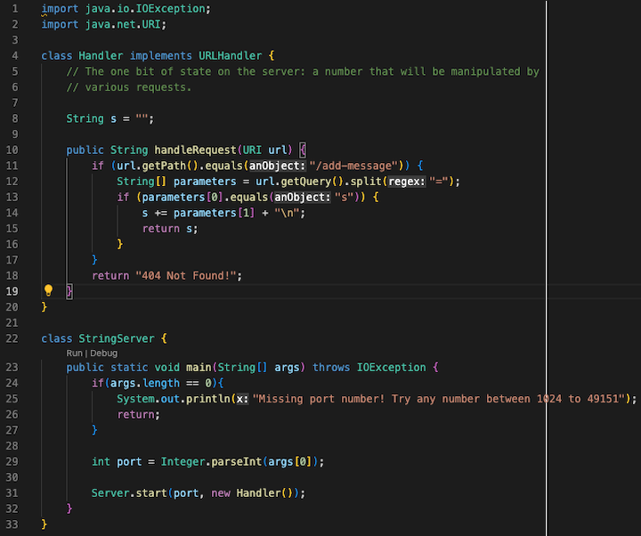
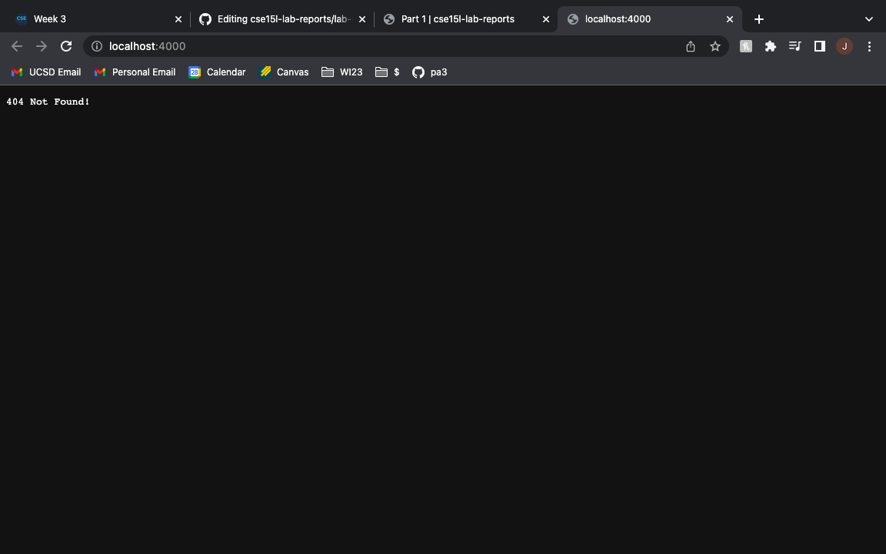
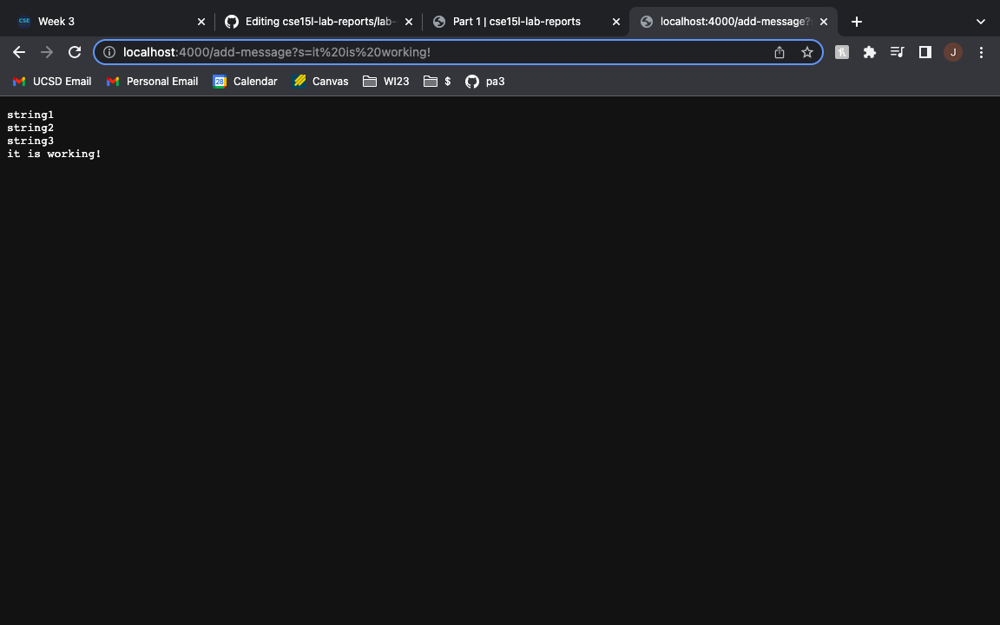
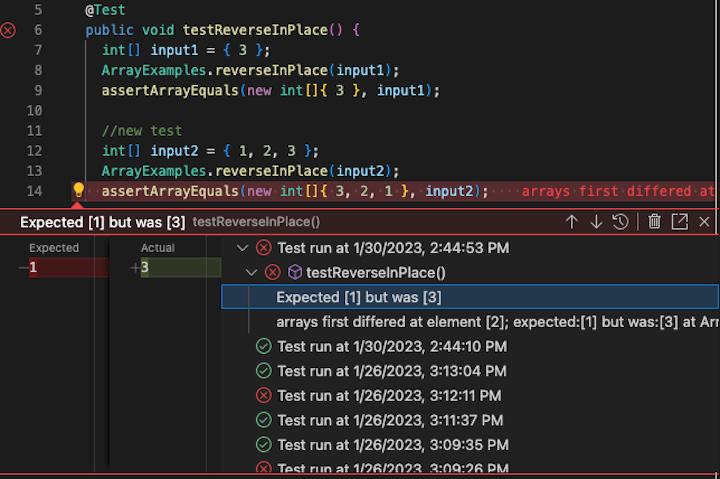

Part 1
---
This is the code to my string server:



This is the result when I first opened up the webpage without any messages added yet:



This is the result when I added a couple messages:



Part 2
---
A failure-inducing input for the buggy program:
```
@Test
public void testReverseInPlace() {
    int[] input2 = { 1, 2, 3 };
    ArrayExamples.reverseInPlace(input2);
    assertArrayEquals(new int[]{ 3, 2, 1 }, input2);
}
```
When I have the input array of `{1, 2, 3}`, I would expect the `reverseInPlace()` to reverse the array and return the array `{3, 2, 1}`. This induced an error because the actual output was instead remained the same as `{1, 2, 3}`.

An input that doesn’t induce a failure:
```
@Test
public void testReverseInPlace() {
    int[] input1 = { 3 };
    ArrayExamples.reverseInPlace(input1);
    assertArrayEquals(new int[]{ 3 }, input1);
}
```
The input array of only one element such as `{3}` will not induce a failure because there is only one element, the symptom of not reversing the array does not affect the output in this case.

The symptom is that they return the same array even though I expected an reversed array.

The failing result of JUnit test:


There are two bugs I found that caused the same symptom of not reversing the array:
- It only copies one side to the other, when what we want is actually swapping the front and the end.
- The for-loop looped through the entire array when instead it should only be half of the array because if you loop through the entire it would just counter the swap and resulting in the same array.

Before fix:
```
static void reverseInPlace(int[] arr) {
    for (int i = 0; i < arr.length; i += 1) {
        arr[i] = arr[arr.length - i - 1];
    }
}
```

After fix:
```
static void reverseInPlace(int[] arr) {
    for (int i = 0; i < arr.length / 2; i += 1) {
        int temp = arr[i];
        arr[i] = arr[arr.length - i - 1];
        arr[arr.length - i - 1] = temp;
    }
}
```

Notice that now the array is looped to the middle of the array and swapping the elements of the front and its corresponding end indexes.

Part 3
---
Something I learned from lab in week 2 and 3 that you didn’t know before is the stucture of URL's. I learned the meanings of different sections of the long chain of letters, slashes, and different symbols. I learned what domain, path, query, and fragment are, and what information they provide. I learned to use them in couple practice such as the number counter, search engine, and string appender.
