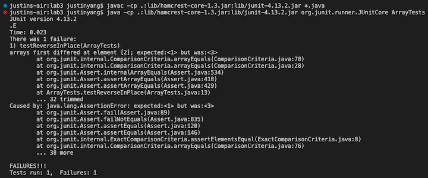
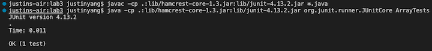

Part 1
---
This is the code for my string server:


This is the result when I first opened up the webpage without any messages added yet:


Notice how it says page not found because I did not have a path which tells my string server to add a message.

When I run my code, it creates the new Handler object which contains the method handleRequest which takes care of how I add messages to my webpage. The relevant argument I have is the url, which contains the information I need for adding messages to my webpage. Values I have are the url that tells me whether it has the path and the query I am looking for, in this case, `/add message` is the path I am looking for, and `?s=<string>` is the query where the `<string>` is the message I am adding. When missing any of the above, the page would show `404 Not Found!`. In this screenshot, since I didn't include the path `/add message`, it went straight to the return statement for no page found.

This is the result when I added a couple messages:


Now I can add one more with spaces:


Most of the things are the same as the above screenshot, we have same methods called and same arguments. What is different is that, when I have the correct paths and also the query, I run the statements inside the if statements and return the string that contains all the messages I added, so this case I have some extra values like `s` which is the string that I concatanate to everytime there is new string given to the url, and also `=` which is the spiter for the query indicating whatever is after that is the message. `/add message` and the `s` in front of `=` are also strings we check for if it is a valid url.

Part 2
---
A failure-inducing input for the buggy program:

```
@Test
public void testReverseInPlace() {
    int[] input2 = { 1, 2, 3 };
    ArrayExamples.reverseInPlace(input2);
    assertArrayEquals(new int[]{ 3, 2, 1 }, input2);
}
```

A failing JUnit test: 



When I have the input array of `{1, 2, 3}`, I would expect the `reverseInPlace()` to reverse the array and return the array `{3, 2, 1}`. This induced an error because the actual output was instead remained the same as `{1, 2, 3}`.

An input that doesn’t induce a failure:

```
@Test
public void testReverseInPlace() {
    int[] input1 = { 3 };
    ArrayExamples.reverseInPlace(input1);
    assertArrayEquals(new int[]{ 3 }, input1);
}
```

A passing JUnit test: 



The input array of only one element such as `{3}` will not induce a failure because there is only one element, the symptom of not reversing the array does not affect the output in this case.

Notice how a buggy program can sometime still result in a passing test depends on your input, so that is the reason why we need to write tests addressing different inputs to find the bug in the program.

The symptom is that they return the same array even though I expected an reversed array.

The failing result of JUnit test:


There are two bugs I found that caused the same symptom of not reversing the array:
- It only copies one side to the other, when what we want is actually swapping the front and the end.
- The for-loop looped through the entire array when instead it should only be half of the array because if you loop through the entire it would just counter the swap and resulting in the same array.

Before fix:

```
static void reverseInPlace(int[] arr) {
    for (int i = 0; i < arr.length; i += 1) {
        arr[i] = arr[arr.length - i - 1];
    }
}
```

After fix:

```
static void reverseInPlace(int[] arr) {
    for (int i = 0; i < arr.length / 2; i += 1) {
        int temp = arr[i];
        arr[i] = arr[arr.length - i - 1];
        arr[arr.length - i - 1] = temp;
    }
}
```

Notice that now the array is looped to the middle of the array and swapping the elements of the front and its corresponding end indexes.

Part 3
---
Something I learned from lab in week 2 and 3 that you didn’t know before is the stucture of URL's. I learned the meanings of different sections of the long chain of letters, slashes, and different symbols. I learned what domain, path, query, and fragment are, and what information they provide. I learned to use them in couple practice such as the number counter, search engine, and string appender.
