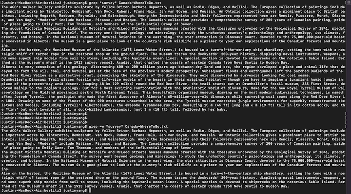
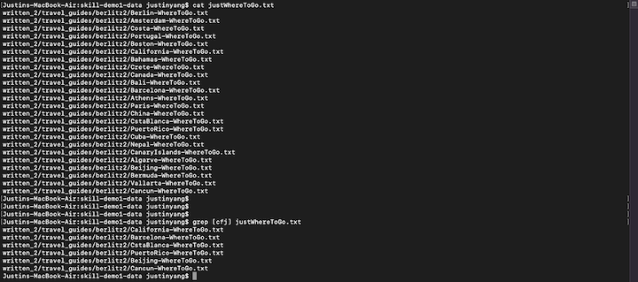
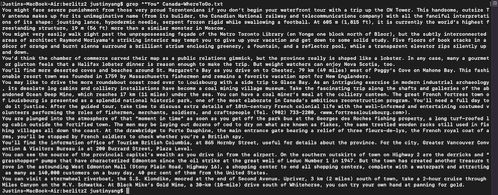
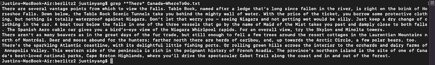
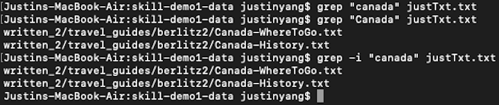
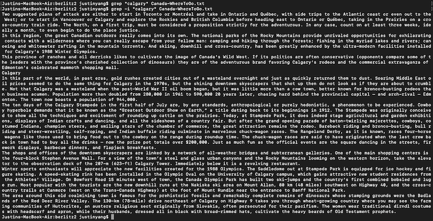

In this lab report I am going to research on the `grep` command line options. Examples of them would be provided using the files and directories from `./written_2` provided in class.

`grep -w <string> <path/to/file>`
---

This command line option helps you search for a specific word with out giving you words that contains the word you are searching for.

For example, you want to find the word "the", words like "then" or "they", any words containing "the" as part of their word is going to match. With this command line option, it will only give you lines containing "the".

Example 1: grep -w "survey" Canada-WhereToGo.txt



- `grep "survey" Canada-WhereToGo.txt`

```
The AGO's...
The august...
Also on the harbor...
Alberta is...
Drumheller's Dinosaur...
```

- `grep **-w** "survey" Canada-WhereToGo.txt`

```
The AGO's...
The august...
Also on the harbor...
```

I wanted try find the word "survey" in the `Canada-WhereToGo.txt` file. However, it is giving me paragraphs (technically lines because grep thinks a paragraph as a line) with the word "surveyors". On the bottom, I uses the command line option `-w` to limiting only to the word "survey", and not others containing it. Notice there is less printed out.

Example 2:


- `grep "marriage" Canada-WhereToGo.txt`

```
Since 1772...
The rue St-Sulpice...
```

- `grep **-w** "marriage" Canada-WhereToGo.txt`

```
<nothing printed>
```

I want the search the word "marriage", it gives me line with the word "marriageable". With `-w` it shows no results meaning there is no word as "marriage" in the passage.

`grep [<list or range of letters>] <path/to/file>`
---

This command line option provide us to search for multiple letters in a file if we put them into a list. There are two choices, either look for individual letters or ranges of letters. I stick to [list of letters] for my examples, such as [aeiou], searching for letters a, e, i, o, and u. While it can also be [range of letters], like [a-e], which search for a, b, c, d, and e. However, it is hard to find a range of letter using the text file as the path contains most of the letters and I don't want it to return every line. 

I created a text file containing all the paths with file names containing "WhereToGo" for easier demonstrating this command line option with examples.

```
Justins-MacBook-Air:skill-demo1-data justinyang$ cat justWhereToGo.txt
written_2/travel_guides/berlitz2/Berlin-WhereToGo.txt
written_2/travel_guides/berlitz2/Amsterdam-WhereToGo.txt
written_2/travel_guides/berlitz2/Costa-WhereToGo.txt
written_2/travel_guides/berlitz2/Portugal-WhereToGo.txt
written_2/travel_guides/berlitz2/Boston-WhereToGo.txt
written_2/travel_guides/berlitz2/California-WhereToGo.txt
written_2/travel_guides/berlitz2/Bahamas-WhereToGo.txt
written_2/travel_guides/berlitz2/Crete-WhereToGo.txt
written_2/travel_guides/berlitz2/Canada-WhereToGo.txt
written_2/travel_guides/berlitz2/Bali-WhereToGo.txt
written_2/travel_guides/berlitz2/Barcelona-WhereToGo.txt
written_2/travel_guides/berlitz2/Athens-WhereToGo.txt
written_2/travel_guides/berlitz2/Paris-WhereToGo.txt
written_2/travel_guides/berlitz2/China-WhereToGo.txt
written_2/travel_guides/berlitz2/CstaBlanca-WhereToGo.txt
written_2/travel_guides/berlitz2/PuertoRico-WhereToGo.txt
written_2/travel_guides/berlitz2/Cuba-WhereToGo.txt
written_2/travel_guides/berlitz2/Nepal-WhereToGo.txt
written_2/travel_guides/berlitz2/CanaryIslands-WhereToGo.txt
written_2/travel_guides/berlitz2/Algarve-WhereToGo.txt
written_2/travel_guides/berlitz2/Beijing-WhereToGo.txt
written_2/travel_guides/berlitz2/Bermuda-WhereToGo.txt
written_2/travel_guides/berlitz2/Vallarta-WhereToGo.txt
written_2/travel_guides/berlitz2/Cancun-WhereToGo.txt
```

Example 1:



- `grep [cfj] justWhereToGo.txt`

```
written_2/travel_guides/berlitz2/California-WhereToGo.txt
written_2/travel_guides/berlitz2/Barcelona-WhereToGo.txt
written_2/travel_guides/berlitz2/CstaBlanca-WhereToGo.txt
written_2/travel_guides/berlitz2/PuertoRico-WhereToGo.txt
written_2/travel_guides/berlitz2/Beijing-WhereToGo.txt
written_2/travel_guides/berlitz2/Cancun-WhereToGo.txt
```

I want to look for lines that contains letters c, f, or j, and as shown above, I can do it with this specific command line option.

Example 2:


- `grep [kpq] justWhereToGo.txt`

```
written_2/travel_guides/berlitz2/Nepal-WhereToGo.txt
```
  
Same as above example, this time look for letters k, p, or q. 

`grep ^<string> path/to/file`
---
  
This command line option can look for specific string in the beginning of each line.

Example 1:



`grep ^"You" Canada-WhereToGo.txt`

```
You might face severe...
You might very easily...
You'd think the chamber...
You'll find more...
You may like...
You are plunged into...
You'll find the information...
You can see the source...
You can visit...
```
  
I want to look for lines that start with the word "You", and this command line option helps with that.

Example 2:



`grep ^"There" Canada-WhereToGo.txt`

```
There are several...
There aren't as many...
```
  
This time I look for lines that start with the word "There", it shows only one line with "There" as first word of the paragraph.

`grep -i <string> <path/to/file>`
---

This command line option look for the string in the file and is case insensitive.
    
Example 1:



`grep **-i** "canada" justTxt.txt`

```
written_2/travel_guides/berlitz2/Canada-WhereToGo.txt
written_2/travel_guides/berlitz2/Canada-History.txt
```
    
In this example, I search for the word "canada" with normal `grep` and it did't show any result. The `-i` helped look for the word case insensitively and print lines with "Canada".

Example 2:



`grep **-i** "calgary" Canada-WhereToGo.txt`

```
Two suggested plans...
In this region...
This province of ranches...
Calgary
In this part of the world...
The ten days...
The shops and offices...
Winter sports...
The area around...
```
    
Similarly, when I look in the file `Canada-WhereToGo.txt` for the word "calgary" it doesn't show any result unless I put the case insensitive command line option `-i`.
