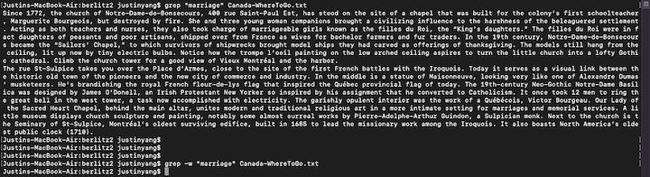

In this lab report I am going to research on the `grep` command line options. Examples of them would be provided using the files and directories from `./written_2` provided in class.

`grep -w <string> <path/to/file>`
---

This command line option helps you search for a specific word with out giving you words that contains the word you are searching for.

For example, you want to find the word "the", words like "then" or "they", any words containing "the" as part of their word is going to match. With this command line option, it will only give you lines containing "the".

`grep [<list or range of letters>] <path/to/file>`
---

`grep ^<string> path/to/file`
---

`grep -i <string> <path/to/file>`
---

