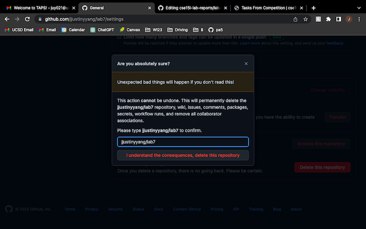
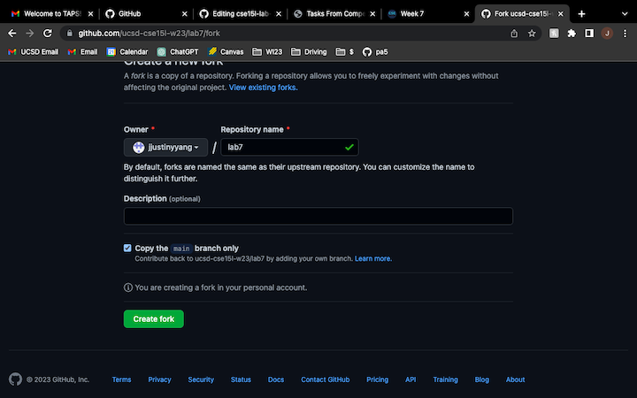
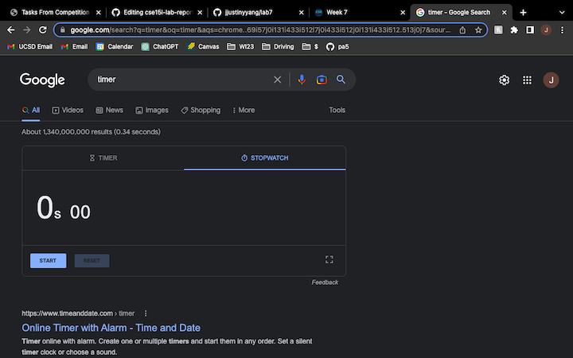
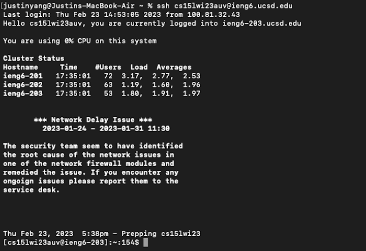
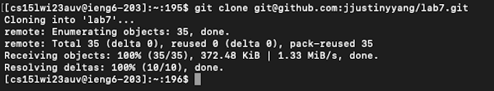
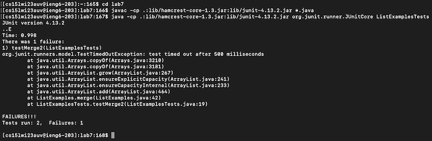
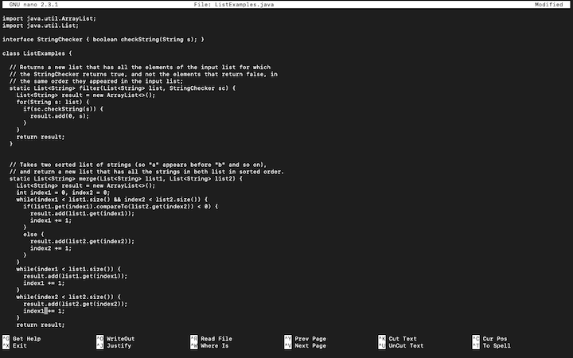
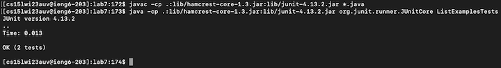
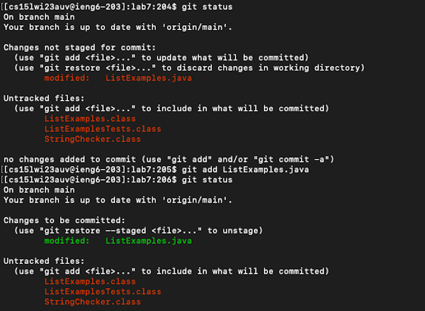
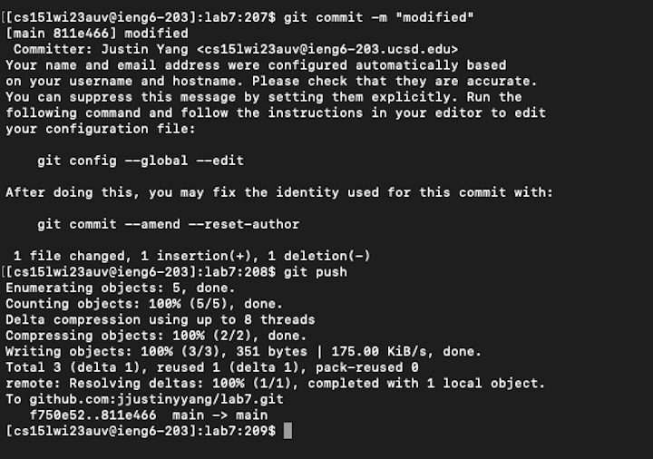

Tasks From Competition
---
1. Setup Delete any existing forks of the repository you have on your account
2. Setup Fork the repository
3. The real deal Start the timer!
4. Log into ieng6
5. Clone your fork of the repository from your Github account
6. Run the tests, demonstrating that they fail
7. Edit the code file to fix the failing test
8. Run the tests, demonstrating that they now succeed
9. Commit and push the resulting change to your Github account

(1) Setup Delete any existing forks of the repository you have on your account
---

If previously forked the repository, delete it to ensure fairness of competition.

Inside the repository, go to Setting --> Danger Zone --> Delete this repository

Read the warning, type the name of the repository you want to delete to verify deleting the correct repository.

(2) Setup Fork the repository
---

Fork the [lab 7 repository](https://github.com/ucsd-cse15l-w23/lab7).

(3) The real deal Start the timer!
---

Phone, on-line, or any timer.

(4) Log into ieng6
---

Log into remote server `ieng6`. Type in terminal: `ssh cs15lwi23auv@ieng6.ucsd.edu`

It should not prompt for password after the set up I did in lab.

(5) Clone your fork of the repository from your Github account
---

Clone the repository I forked using command line: `git clone git@github.com:jjustinyyang/lab7.git`.

Again, with the set up I did in lab, I can clone the fork using `ssh`. The set up allows me to create a new SSH private key for accessing Github from my ieng6 account, which lets me commit and push my code later easier.

(6) Run the tests, demonstrating that they fail
---
`cd` (change directory) into the folder created after cloning: `cd lab7`

Inside the folder, compile all java files and run junit on the test file `ListExamplesTests.java`:

`javac -cp .:lib/hamcrest-core-1.3.jar:lib/junit-4.13.2.jar *.java`

and

`java -cp .:lib/hamcrest-core-1.3.jar:lib/junit-4.13.2.jar org.junit.runner.JUnitCore ListExamplesTests`

There is an error that we need to fix!

(7) Edit the code file to fix the failing test
---

When we open the `ListExamplesTests.java` file on Github, we can see that the test methods only run for `merge` method, so we can focus on that method to find the bug in it.

`nano` inside the `ListExamples.java` file to look at / modify the code: `nano ListExamples.java`.

I found where the bug is: while-loop for list2 after comparing two lists to add the remaining strings. The increasing index of list2 should be index2 not index1.

I use the arrow keys to navigate to where the bug is and fixed it.

After fixing the bug, I saved the file using `<Ctrl O>` and `<enter>`, exit `nano` using `<Ctrl X>`.

(8) Run the tests, demonstrating that they now succeed
---
Do the steps in step 6, but this time we are already inside lab7 folder so no need to `cd` into it.

To save time, I did 6 up arrow keys to get to the previously ran junit command lines. 

Both `javac...` and `java...` will need exactly 6 up arrow : `<up><up><up><up><up><up><enter>`.

 
This time, all the tests passed.

(9) Commit and push the resulting change to your Github account
---
First, I use `git status` to see what are the changes to the folders I cloned (modification in `ListExamples.java` and new class files for the all the `.java` compiling). They are in red texts.

Next, I only want to push the changes inside `ListExamples.java`, so I will only add that file. Similar to checking only the box for it if it is web version GitHub: `git add ListExamples.java`. Now `ListExamples.java` is in green when I do `git status` again, meaning it is ready to push.

Then, I can commit the changes, can be known as saving what is going to be ready to push: `git commit -m "modified"`, with a "modified" message.

Finally, `git push`, pushing the changes back to my GitHub account.

 

