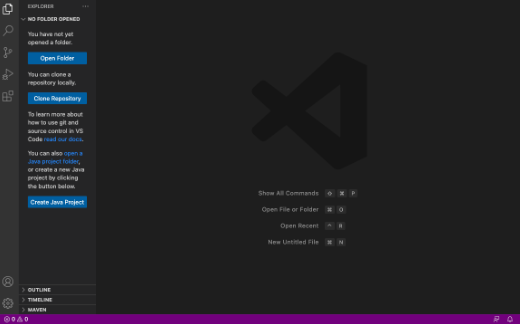
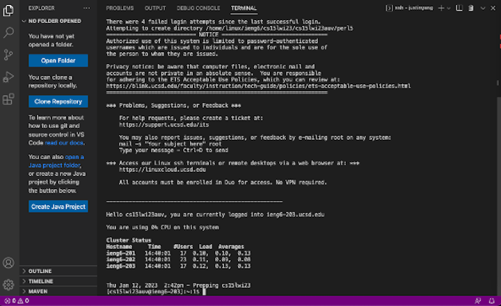
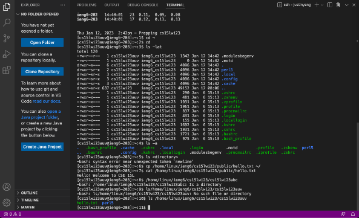

Week 1 Lab Report
---

Installing VScode
---
To install VScode, go to the following website, [https://code.visualstudio.com/](https://code.visualstudio.com/).  
There should be the version for most common operating systems (macOS and Windows).  
Follow the instruction given from it after.

VScode should look like something like this once installed:  

Remotely Connecting
---
Before attempt remotely connecting your computer to school server, you will need to know your course-specific account for CSE15L.

Go to this [link](https://sdacs.ucsd.edu/~icc/index.php).

Open VScode terminal, Terminal > New Terminal.

Type into terminal: "ssh" following your course-specific account.

You should be prompt with your password. 

After comfirming correct password, you are logged in remotely connecting with the school server.

Trying Some Commands
---
Try getting some practice with typing commands in the terminal. 

Ex:  
cd ~  
ls -lat  
ls /home/linux/ieng6/cs15lwi23/cs15lwi23abc (replace abc with a groupmate's username)  
cp /home/linux/ieng6/cs15lwi23/public/hello.txt ~/  
cat /home/linux/ieng6/cs15lwi23/public/hello.txt

